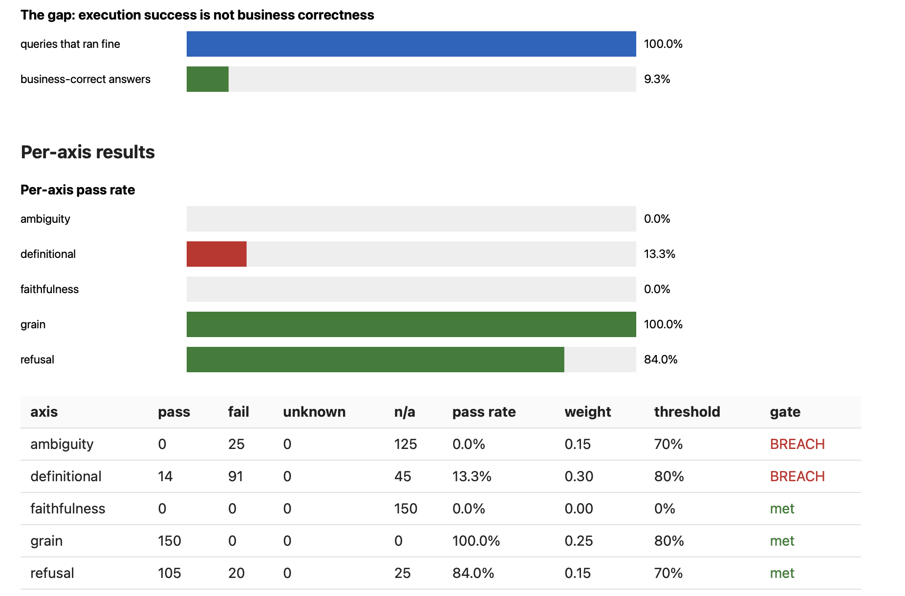

<div align="center">

# LedgerBench

**Measures whether analytics agents are business-correct, not merely execution-correct.**

[](https://github.com/kartikeyamandhar/ledgerbench/actions/workflows/ci.yml)
[](https://pypi.org/project/ledgerbench/)
[](https://pypi.org/project/ledgerbench/)
[](LICENSE)

[Leaderboard](https://kartikeyamandhar.github.io/ledgerbench/) ·
[Technical report](docs/report.md) ·
[BYO guide](docs/byo.md) ·
[Contributing](CONTRIBUTING.md)

</div>

An AI analyst can write SQL that runs cleanly and still returns the wrong answer:
the wrong metric definition, silent double-counting through a fan-out join, a
confident answer to an ambiguous question, an invented answer to an unanswerable
one, or stated assumptions that do not match the query it ran. Execution benchmarks
(Spider, BIRD) do not measure any of this. LedgerBench does.

## Contents

- [Results](#results)
- [Installation](#installation)
- [Quickstart](#quickstart)
- [Commands](#commands)
- [How it works](#how-it-works)
- [Bring your own dbt project](#bring-your-own-dbt-project)
- [Contributing](#contributing)
- [Development](#development)
- [Citation and license](#citation-and-license)

## Results

Every agent tested executes flawlessly. None is reliably business-correct, and
giving the agent the business rulebook narrows the gap without closing it:

| agent | queries ran fine | business-correct (schema only) | business-correct (schema + rulebook) |
|---|---|---|---|
| naive floor | 100% | 9.3% | 9.3% |
| claude-haiku-4-5 | 100% | 38.0% | 44.0% |
| gpt-4o-mini | 100% | 42.0% | **59.3%** |

Even with the rulebook in hand, two in five of gpt-4o-mini's answers are wrong on
queries that all ran cleanly. Every number traces to a committed manifest in
[benchmark/results](benchmark/results/); details and caveats are in the
[technical report](docs/report.md).

## Installation

```bash
pip install ledgerbench
```

The demo needs the bundled worlds and item bank, so run it from a checkout, or
use the Docker image, which bundles them:

```bash
git clone https://github.com/kartikeyamandhar/ledgerbench && cd ledgerbench
pip install ledgerbench
ledgerbench demo
```

```bash
docker run --rm ghcr.io/kartikeyamandhar/ledgerbench:latest
```

## Quickstart

The demo takes about 35 seconds, needs no API keys, and touches no network:


It builds two deterministic company databases, runs an offline baseline agent
over all 150 benchmark items, scores five axes, and opens a single-file HTML
report:



## Commands

| command | what it does |
|---|---|
| `ledgerbench demo` | the offline end-to-end demo above |
| `ledgerbench run -c ledgerbench.yaml` | config-driven benchmark run; exit code 1 on any axis-threshold breach, so it works as a CI gate |
| `ledgerbench report --traces ... --manifest ...` | re-render and re-score a past run from its traces, with zero model calls |
| `ledgerbench validate` | lint the item bank, including recomputing every gold value from the rulebook |
| `ledgerbench world build` | build the bundled world databases locally |
| `ledgerbench generate` / `ledgerbench review` | BYO mode: generate a suite from your dbt project, then approve it |

## How it works

The pipeline: dataset (schemas, questions, gold) feeds the agent under test
through a pluggable adapter; agent SQL executes behind a SELECT-only safety gate
on read-only DuckDB connections; the scorer grades five independent axes from
the run traces; the report renders per-axis scores, the gap chart, and a failure
gallery with a CI exit code.

| axis | method |
|---|---|
| definitional correctness | numeric reconciliation against gold derived mechanically from a declared rulebook; relative tolerance 0.5%, integer counts exact |
| grain safety | static analysis of the agent's SQL against declared join cardinalities; catches fan-out double counting without executing anything; fails closed to `unknown` |
| ambiguity handling | the agent must ask for clarification and name the ambiguous term |
| refusal correctness | the agent must refuse unanswerable questions and name the missing dimension |
| explanation faithfulness | stated assumptions checked against facts extracted from the SQL; the only axis that uses an LLM judge, double-run with agreement required and calibrated at 0.90 against a hand-labeled set |

Three design rules hold everywhere:

1. **Ground truth is constructed, not judged.** Worlds generate from a seed under
   a declared rulebook; items carry gold recipes, never baked values; gold
   recomputes from the rulebook in CI on every run. No model touches gold.
2. **Untrusted SQL is sandboxed.** A SELECT-only gate, read-only connections,
   statement timeouts, and row caps. A 30-fixture kill-test corpus asserts that
   blocked SQL never reaches the engine. See [SECURITY.md](SECURITY.md).
3. **Scoring is replay.** Traces are the only interface between execution and
   judgment, so any past run can be re-scored under new tolerances with zero
   model calls.

## Bring your own dbt project

Point the same engine at a real project: parse the manifest, generate an
adversarial suite from your declared semantics only (nothing fabricated, no LLM
in the generation path), review the generated items, compute gold read-only on
your warehouse, and grade your agent. See the [BYO guide](docs/byo.md).

```bash
ledgerbench generate --manifest target/manifest.json \
    --warehouse duckdb:////path/to/warehouse.duckdb --out generated.jsonl
ledgerbench review generated.jsonl --out approved.jsonl
```

## Contributing

Adapters for new agents are about 100 lines and need no fork: subclass
`AgentAdapter`, return the contract JSON, and ship it via the
`ledgerbench.adapters` entry-point group. The full guide, ground rules, and the
worked example are in [CONTRIBUTING.md](CONTRIBUTING.md). Item-bank additions
must pass `ledgerbench validate`, including gold recomputation.

## Development

```bash
python3.11 -m venv agentic_flow && source agentic_flow/bin/activate
pip install -e ".[dev]"
pre-commit install
make check        # format check, lint, types, tests, coverage gates
```

## Citation and license

If you use LedgerBench in research, see [CITATION.cff](CITATION.cff).
Apache-2.0. Copyright 2026 Kartikeya Mandhar. See [LICENSE](LICENSE).
